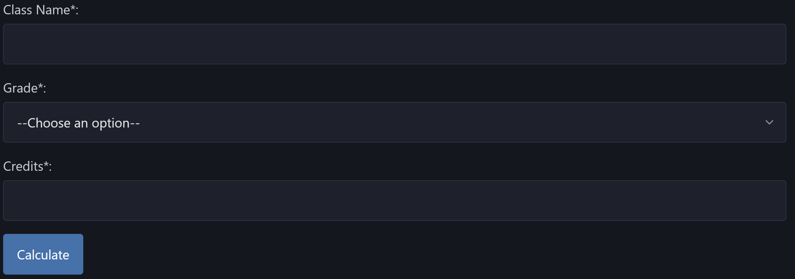
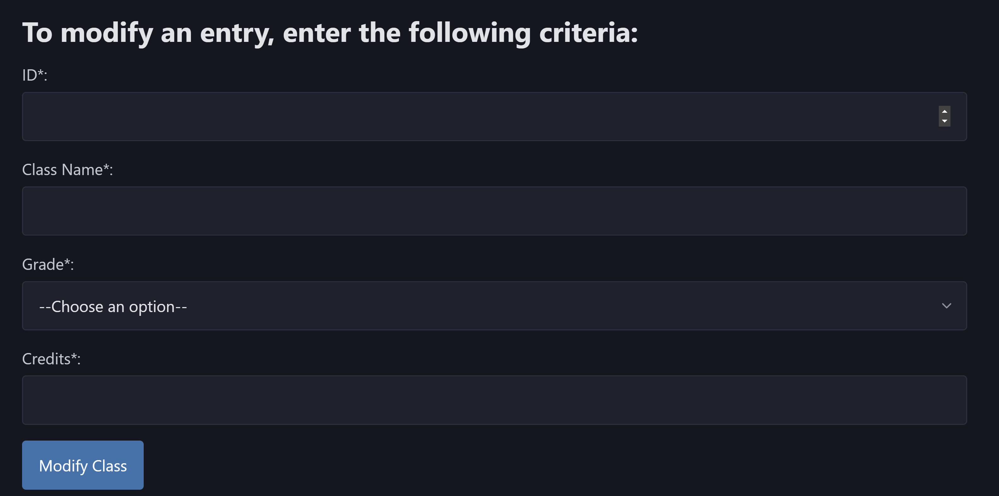

## Your Web Application Title

Include a very brief summary of your project here. Images are encouraged, along with concise, high-level text. Be sure to include:

- The goal of my application is to store information from a user on their specific college classes, using that information my application returns the user's cumulative GPA. Users have the ability to add, delete, and modify entries via buttons and view their GPA in real time. 
  The cumulative GPA is shown to the user as follows:  . 
  Once all associated fields in that section are filled in, the calculate button will be clicked to add a class to the users table entries and recalculate their GPA as shown here:  .
  Once all associated fields in that section are filled in, the delete button will be clicked to delete a class from the users table entries and recalculate their GPA as shown here:  .
  Once all associated fields in that section are filled in, the modify button will be clicked to modify a class in the users table entries and recalculate their GPA as shown here:  .

- I faced many challenges with implementing the cookies strategy of using the serializeUser and deserializeUser functions. There were times where I thought I fixed my issue but then 20 minutes later the code would break in the same place. I realized later on that my issue was with the attribute I was trying to use in the serializeUser function. I was happy to overcome this challenge because it was one of the final obstacles I had to overcome before having my OAuth implementation fully work. 

- I chose OAuth via Github as my authentication strategy because it seemed to be easier than having to handle a manual login since it github provides a special id back that I got to use. This really streamlined my login implementation since it took out a lot of the in between stuff I would have to otherwise handle. Furthermore, there was plenty of online documentation of this strategy so I was able to look at the passport.js guidelines in times where I felt lost. 

- I used the Pico css framework since it is minimalist and prioritizes semantic syntax, making every HTML element responsive and elegant by default. It required the least amount of editing and I liked how it offered a dark mode with a high enough contrast. Furthermore, this framework helped me reach 100% on every lighthouse test which I appreciated extra. 
  I did not modify the CSS framework with my own CSS, I did not delete the CSS file from my folder even though it is not referenced in either my html files because that made me feel a little uneasy. Ultimately the only styling on my application is that provided by pico.css, I did not include a customize css as stylesheets for either of my html files.

## Technical Achievements
- **Tech Achievement 1**: I used OAuth authentication via the GitHub strategy. To accomplish this I registered my application on github identifiying its homepage URL and redirect URI. I then connecting this to my application by putting the client ID and secret in the .env file which is hidden. From there I installed passport.js functionality as well as the github strategy to enable the OAuth process. Finally, I combed through many documentation and tutorials to understand the implementation process and use of the github strategy for OAuth. I had a challenge with redirect URI at first, it took about 3 hours for me to realize I was missing a slash in my app.get. Furthermore, I had a hard time keeo unauthorized users out of the main page, however, I used a combination of the inclass code cookie example to understand whether a user is logged in or not to ensure that only logged in users have acccess to profile page. 
- **Tech Achievement 3**: I achieved 100% on all 4 of the lighthouse tests. I did this as a trial and error process. I began by analyzing my intial payload then taking the google suggestions and updating my code accordingly. By taking a gradual piece by piece approach I was able to reach 100% on all 4. This was challenging when using the css frameworks because a lot of them added on many features that slowed down the page since they were unused by me in my html, this led to me using pico.css which I found enhanced my lighthouse score! 

### Design/Evaluation Achievements
- **Design Achievement 1**: I followed the following 12 tips from the W3C Web Accessibility Initiative:
  1. **Provided a short title that describes the page content and distinguishes it from other pages**. The page title is often the same as the main heading of the page. Put the unique and most relevant information first; for example, put the name of the page before the name of the organization. For pages that are part of a multi-step process, include the current step in the page title.
  2. Use short headings to group related paragraphs and clearly describe the sections. Good headings provide an outline of the content.
  3. Keep content clear and concise: Write in short, clear sentences and paragraphs. Avoid using unnecessarily complex words and phrases. Expand acronyms on first use. For example, Web Content Accessibility Guidelines (WCAG).
  4. Provide sufficient contrast between foreground and background: Foreground text needs to have sufficient contrast with background colors. This includes text on images, background gradients, buttons, and other elements. 
  5. Ensure that form elements include clearly associated labels. all fields have a descriptive label adjacent to the field. Avoid having too much space between labels and fields.
  6. Use headings and spacing to group related content. Use whitespace and proximity to make relationships between content more apparent. Style headings to group content, reduce clutter, and make it easier to scan and understand.
  7. Associate a label with every form control
  Use a for attribute on the <label> element linked to the id attribute of the form element, or using WAI-ARIA attributes.
  8. Identify page language and language changes
  Indicate the primary language of every page by using the lang attribute in the html tag, for example <html lang="en">. 
  9. Reflect the reading order in the code order
  Ensure that the order of elements in the code matches the logical order of the information presented. One way to check this is to remove CSS styling and review that the order of the content makes sense.
  10. Don’t use color alone to convey information
  While color can be useful to convey information, color should not be the only way information is conveyed. When using color to differentiate elements, also provide additional identification that does not rely on color perception. For example, use an asterisk in addition to color to indicate required form fields, and use labels to distinguish areas on graphs.
  11. Provide clear and consistent navigation options
  Ensure that navigation across pages within a website has consistent naming, styling, and positioning. Provide more than one method of website navigation, such as a site search or a site map. Help users understand where they are in a website or page by providing orientation cues, such as breadcrumbs and clear headings.
  12. Make link text meaningful
  Write link text so that it describes the content of the link target. Avoid using ambiguous link text, such as ‘click here’ or ‘read more’. Indicate relevant information about the link target, such as document type and size, for example, ‘Proposal Documents (RTF, 20MB)’.